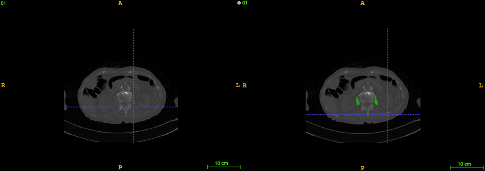

# Psoas Major Muscle Segmentation

This repo includes several frameworks for sementic segmentation of 2D CT images of the psoas-major muscle. 

Here is a training sample. Raw CT image is on the left, and segmentation result is on the right. The segmentation mask is marked as green. 



In this repo, FCN, UNet and UNet++ is implemented to tackle semantic segmentation problem.

The framework of FCN and UNet++ is illustrated as below.

||
|:--:|
|*FCN Framework*|

||
|:--:|
|UNet++ Framework|

### 1. Data and Source Code
i. Get source code
```bash
➜ https://github.com/XU-YaoKun/psoas_major_muscle_segmentation.git
➜ cd psoas_major_muscle_segmentation
```
ii. Get dataset
```bash
➜ mkdir data && cd data
➜ wget https://github.com/XU-YaoKun/psoas_major_muscle_segmentation/releases/download/1.0/imgs.rar
➜ wget https://github.com/XU-YaoKun/psoas_major_muscle_segmentation/releases/download/1.0/labels.rar
➜ unrar x imgs.rar 
➜ unrar x labels.rar
```
### 2. Environment
i. Create a new conda environment
```bash
➜ conda create -n psoas python=3.6
➜ conda activate psoas
➜ pip install -r requirements.txt
```
### 3. Train
First, preprocess the dataset. `Nifti` format will be loaded, and finally saved as `Pickle` file in `data`.
```bash
python preprocess.py
```
To train different models, use different config file. For example, to train `FCN`, using the following command
```bash
python main.py --cfg configs/FCN.yaml
```
And to specify parameters, change corresponding values in .yaml files. Or use command line.
```bash
➜ python main.py --cfg configs/FCN.yaml TRAIN.LR 1e-3 
```
When training is finished, the corresponding logging file will be printed onto screen, and the logging file is named as program launch time.
To check training process, use `tensorboard` to visualize,
```bash
tensorboard --logdir logging_file_path
```

### 4. Experiment result
|    MODEL    | ROUND 1 | ROUND 2 | ROUND 3 |  AVG.  |
| :---------: | :-----: | :-----: | :-----: | :----: |
|     FCN     | 0.5654  | 0.6104  | 0.6028  | 0.5928 |
|    UNET     | 0.8347  | 0.8119  | 0.8557  | 0.8341 |
| NESTED UNET | 0.8630  | 0.8128  | 0.8219  | 0.8326 |

### 5. Reference
[1] Shelhamer, Evan et al. “Fully Convolutional Networks for Semantic Segmentation.” IEEE Transactions on Pattern Analysis and Machine Intelligence 39 (2017): 640-651.
[2] Ronneberger, Olaf et al. “U-Net: Convolutional Networks for Biomedical Image Segmentation.” ArXiv abs/1505.04597 (2015): n. pag.
[3] Zhou, Zongwei, et al. "Unet++: A nested u-net architecture for medical image segmentation." Deep Learning in Medical Image Analysis and Multimodal Learning for Clinical Decision Support. Springer, Cham, 2018. 3-11.


